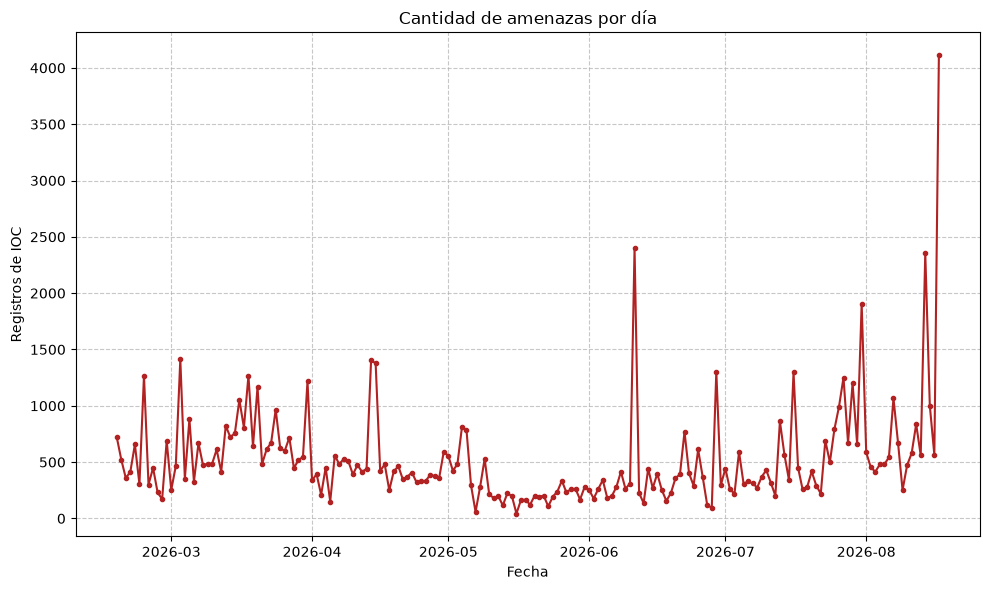
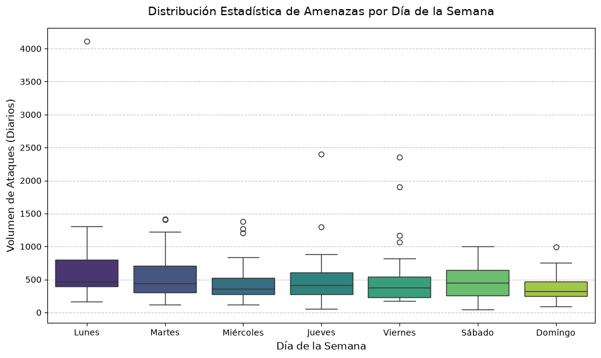
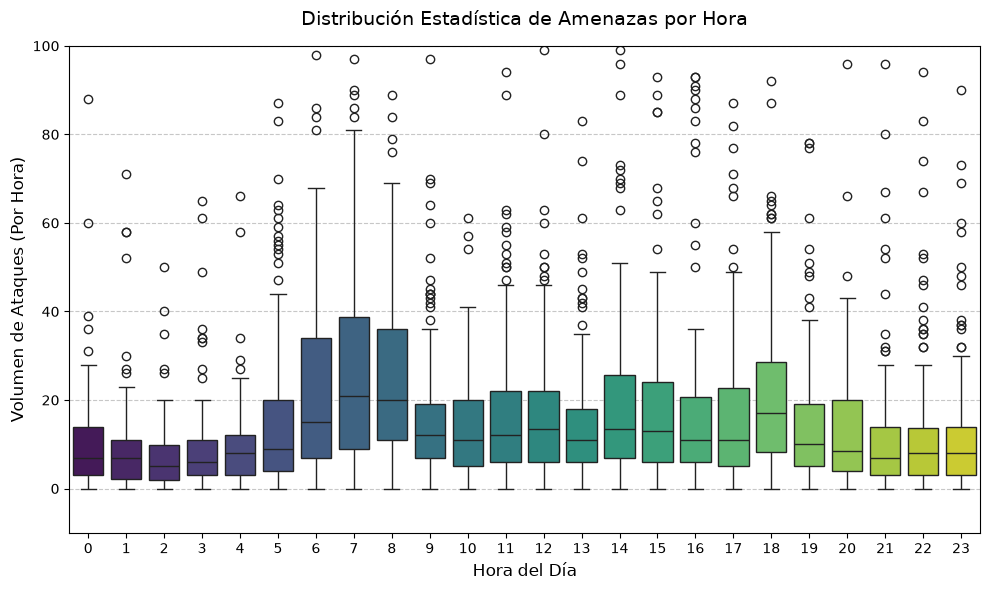
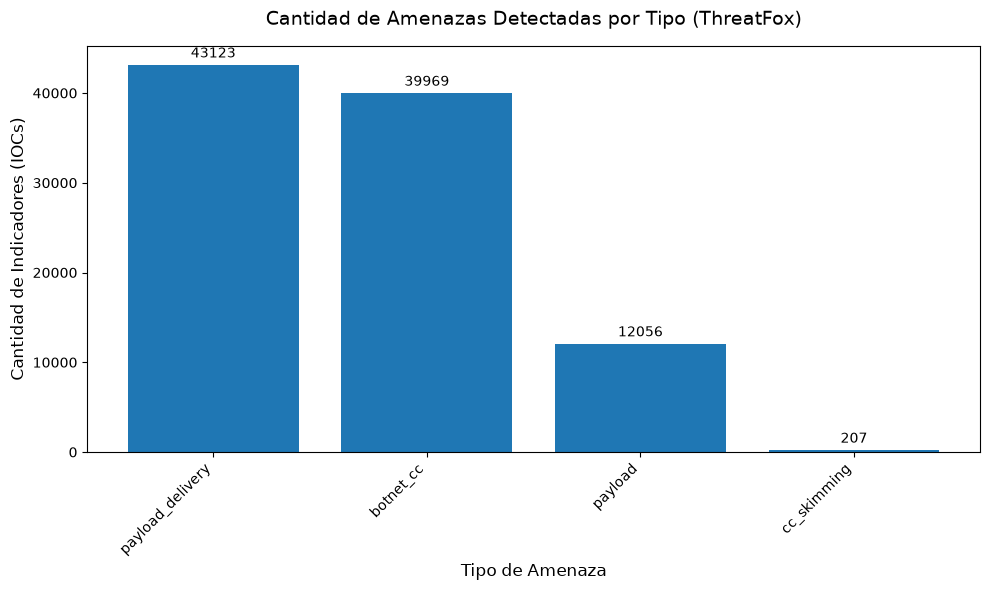
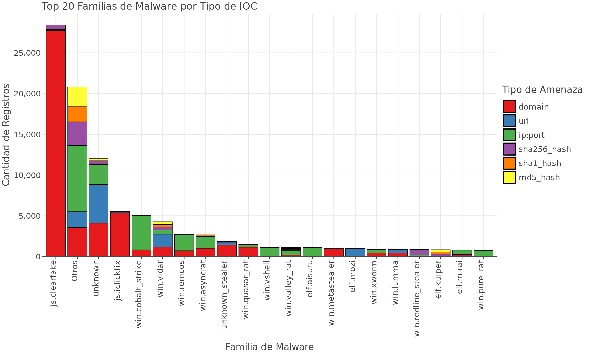

# Reporte de Inteligencia de Amenazas (ThreatFox)
**Fecha de generación automática:** 2026-09-21

## Resumen
Durante el periodo analizado, se procesaron un total de **95,355** indicadores de compromiso (IOCs).
El análisis revela que el mes con mayor actividad maliciosa fue **March**.

La táctica preferida por los adversarios (Threat Type) fue **payload_delivery**, utilizada principalmente para distribuir la familia de malware **js.clearfake**. La infraestructura base más utilizada para estos ataques (IOC Type) fue **domain**.

---

## Análisis Temporal de Actividad
A continuación, se presenta la evolución histórica de las amenazas. El gráfico de cajas y bigotes permite identificar si los atacantes tienen un patrón de trabajo centrado en días laborales o fines de semana, o alguno relacionado con las horas, así como los picos atípicos (outliers) de campañas masivas.

  

  

  

---

## Familias de Malware, IOC y tipo de amenaza

En primer lugar, es importante detectar el tipo de amenaza más frecuente, para identificar algunas medidas de seguridad necesarias.

  

El siguiente gráfico desglosa las familias de malware predominantes y el tipo de infraestructura que las sostiene. Las familias fuera del top 20 han sido agrupadas en la categoría "Otros" para limpiar el ruido estadístico.

  

## Importante  
Métricas como el día o la hora con más ocurrencias pueden resultar útiles, pero
las medidas estadísticas siempre deben ser interpretadas de forma cuidadosa y tomando en
cuenta partes del contexto, como medidas de tendencia central y dispersión.  
Además, cada conjunto posee sus propias características, y debe establecerse un flujo de
trabajo particular para cada uno de ellos.  

*Reporte generado automáticamente mediante Python y Pandas. Datos extraídos de abuse.ch (ThreatFox).*
abuse.ch. (2026). ThreatFox. Recuperado el 2026-08-17, de https://threatfox.abuse.ch/
